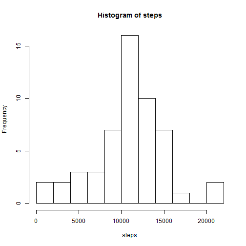
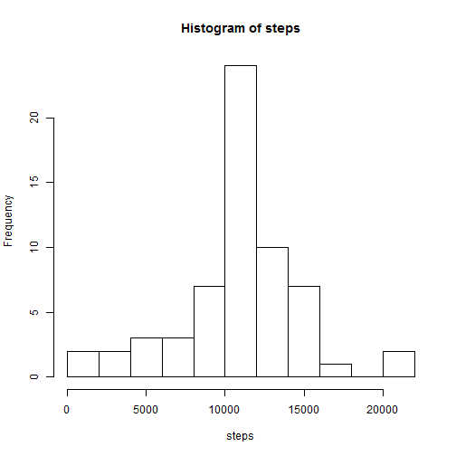
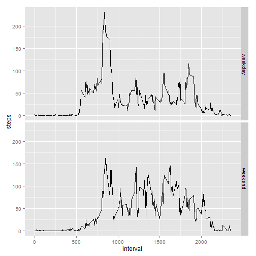

Loading and preprocessing the data


```r
data <- read.csv("activity.csv")   # read in the file

data$date <- as.Date(data$date, format = "%Y-%m-%d")    # convert date column to 
                                                        # date format
```

What is mean total number of steps taken per day?

- Calculate the total number of steps taken per day. Make a histogram of the total number of steps taken each day.


```r
# Collect all the step counts by date and calculate sum:

totalsbydate <- aggregate(steps ~ date, data = data, sum)

# Plot histogram of daily totals:

with(totalsbydate, hist(steps, breaks = 15))
```

 

- The mean number of steps taken for the dates observed is:


```r
mean(totalsbydate$steps)
```

```
## [1] 10766.19
```

- The median number of steps taken for the dates observed is:


```r
median(totalsbydate$steps)
```

```
## [1] 10765
```

What is the average daily activity pattern?

- Make a time series plot (i.e. type = "l") of the 5-minute interval (x-axis) and   the average number of steps taken, averaged across all days (y-axis)


```r
# First, I want to group the data according to the interval and then I want to find
# mean for all the steps taken at that interval across all the observed days

library(dplyr); library(ggplot2)
```

```
## Warning: package 'dplyr' was built under R version 3.1.3
```

```
## 
## Attaching package: 'dplyr'
## 
## The following object is masked from 'package:stats':
## 
##     filter
## 
## The following objects are masked from 'package:base':
## 
##     intersect, setdiff, setequal, union
```

```r
x <- aggregate(steps~interval,data=data,mean)

qplot(interval, steps, data = x, geom = "line")
```

 

- Which 5-minute interval, on average across all the days in the dataset, contains the maximum number of steps?


```r
maxmeansteps <- filter(x, steps==max(steps))

maxmeansteps$interval
```

```
## [1] 835
```

- With an average of:


```r
maxmeansteps$steps
```

```
## [1] 206.1698
```

Imputing missing values

- Calculate and report the total number of missing values in the dataset (i.e. the total number of rows with NAs)


```r
numnas <- filter(data, is.na(steps))

nrow(numnas)
```

```
## [1] 2304
```

- Devise a strategy for filling in all of the missing values in the dataset. The strategy does not need to be sophisticated. For example, you could use the mean/median for that day, or the mean for that 5-minute interval, etc.

- Create a new dataset that is equal to the original dataset but with the missing data filled in.


```r
dataimputed<-data

for(i in seq_len(nrow(dataimputed))){
        
        if(is.na(dataimputed$steps[i])){
                
                dataimputed$steps[i]<-x$steps[x$interval==dataimputed$interval[i]]
        }
}
```

- Make a histogram of the total number of steps taken each day and Calculate and report the mean and median total number of steps taken per day. Do these values differ from the estimates from the first part of the assignment? What is the impact of imputing missing data on the estimates of the total daily number of steps?


```r
# Collect all the step counts by date and calculate sum:

totalsbydate2 <- aggregate(steps ~ date, data = dataimputed, sum)

# Plot histogram of daily totals:

with(totalsbydate2, hist(steps, breaks = 15))
```

 

- The mean number of steps taken for the dates observed is:


```r
mean(totalsbydate2$steps)
```

```
## [1] 10766.19
```

- The median number of steps taken for the dates observed is:


```r
median(totalsbydate2$steps)
```

```
## [1] 10766.19
```

Are there differences in activity patterns between weekdays and weekends?

- Create a new factor variable in the dataset with two levels - "weekday" and "weekend" indicating whether a given date is a weekday or weekend day:


```r
dataimputed2 <- mutate(dataimputed, day = factor(weekdays(date)), daytype = factor(ifelse(day =='Saturday' | day =='Sunday','weekend','weekday')))
```

- Make a panel plot containing a time series plot (i.e. type = "l") of the 5-minute interval (x-axis) and the average number of steps taken, averaged across all weekday days or weekend days (y-axis). See the README file in the GitHub repository to see an example of what this plot should look like using simulated data.


```r
meanstepsbydaytype<-aggregate(steps~daytype + interval, data=dataimputed2, mean)

qplot(interval, steps, data = meanstepsbydaytype, facets = daytype ~., geom = "line")
```

 
